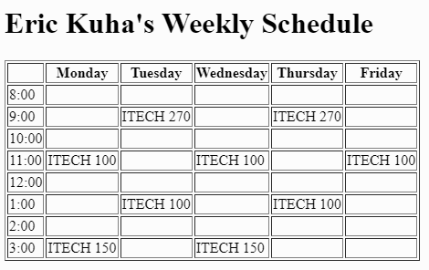

[](https://classroom.github.com/a/lFWO4Edo)
[](https://classroom.github.com/open-in-codespaces?assignment_repo_id=13623381)
# Instructions  

For this exercise, you will gain a little practice building more complex semantic HTML structures. In this case, a table.

You will be creating a weekly schedule with HTML. The end result will look something like this:

  

## Requirements

* You will need exactly one `<table>` element and all other elements will be nested inside it.
* Create a heading at the top using `<h1>`
* The only non-semantic attribute you should use is the `border="1"` attribute inside the `<table>` element so that you can see the borders. Later, we'll learn to do this in CSS.

## Some tips

* Indent your code inside the bigger elements and have individual tags on their own lines. This makes your code easier to read. A list is a good example of this in action. Notice how the `<li>` elements are indented inside the surrounding `<ul>`:

```
    <ul>
        <li>Item one</li>
        <li>Item two</li>
        <li>Item three</li>
        <li>Item four</li>
    </ul>
```

* Take it slow. Work one row at a time and see how it looks before building the next row.
* Ask me for advice if something's not working! I have an extra set of eyes and I can help you spot small errors.
